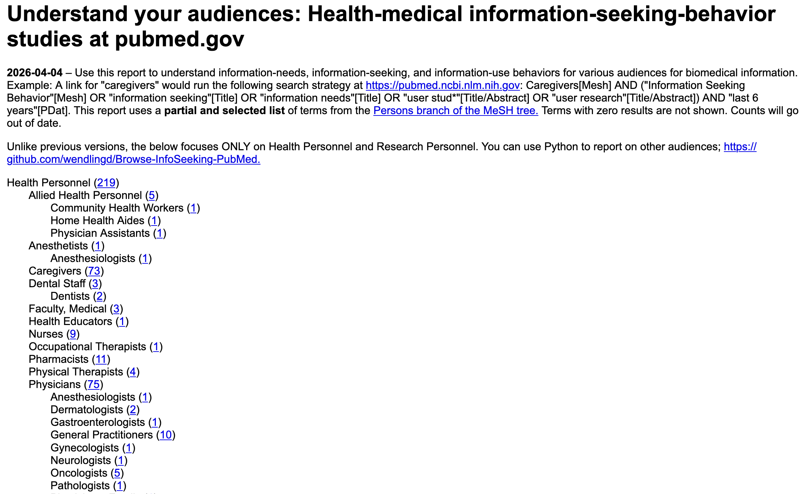

# Use Python to list counts for InfoSeeking studies in PubMed, by audience

### For creators of human-centered health and medicine information products

Task: Let's say you are creating a new web resource for a particular audience, such as "caregivers." What do you know about the information needs, information seeking, and information use behaviors of this audience? The more you know, the more effective your communication will be. Much has been published. Having an ongoing connection to audience research can improve your effectiveness.

How might we create an architecture for audience research, that leverages the tried-and-true controlled vocabulary developed by the U.S. National Library of Medicine over decades, that helps researchers navigate the health, medical, and life sciences information spaces? Meaning, very large volumes of data.

Here we use Python, biopython, and two pieces of the early 2026 version of the Persons branch of the MeSH tree, https://meshb.nlm.nih.gov/record/ui?ui=D009272, to construct encoded URLs that you can use to view database records at https://pubmed.ncbi.nlm.nih.gov. Running this bibliometric reporting periodically can help you and your staff get an uncomplicated foothold into this type of research.

The National Library of Medicine will have the most up-to-date information. This project is not part of, and is not endorsed by, the NLM.

## Sample report output, HTML and screenshot

Number of studies by audience type. 

Preview the HTML report: https://html-preview.github.io/?url=https://github.com/wendlingd/Browse-InfoSeeking-PubMed/blob/master/InfoSeekingStudies.html

Screenshot: 
<kbd></kbd>

## Requirements

- BioPython package, http://biopython.org/DIST/docs/tutorial/Tutorial.html
- Your own MyNCBI credentials file, perhaps in JSON, https://www.ncbi.nlm.nih.gov/books/NBK3842/

This project was coded manually in the past; the most recent updating was assisted by a chatbot.
