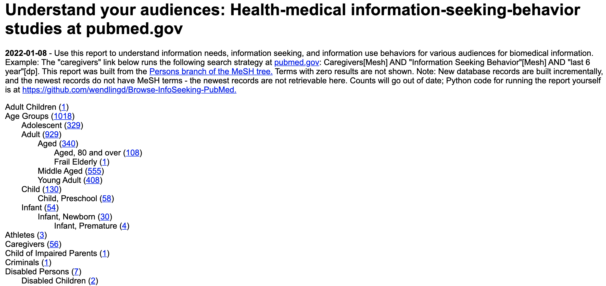

# Python - List counts for InfoSeeking studies in PubMed, by audience

### For builders of human-centered, digital health-medicine products and services

Task: Let's say you are creating a new web resource for a particular 
audience, such as "caregivers." What do you know about the information
needs, information seeking, and information use behaviors of this audience? 
The more you know, the more effective your communication will be. Much has 
been published.

Subject matter experts, product managers, public affairs staff, etc. in
medicine- and health-related disciplines could use an ongoing connection to
this type of research.

This script searches all terms in the top three levels of the Persons branch
of the Persons branch of the Medical Subject Headings (MeSH) tree, 
https://www.ncbi.nlm.nih.gov/mesh/68009272. In the levels below the thrid, some
terms will be included here and others will not be (you can adjust this). Terms 
retrieving zero results are not included in the report.

## Sample report output, HTML and screenshot

Number of studies by audience type. 

Preview the HTML report: http://htmlpreview.github.com/?https://github.com/wendlingd/Browse-InfoSeeking-PubMed/blob/master/InfoSeekingStudies.html (don't use IE - not supported)

Screenshot: 
<kbd></kbd>

## Details

Through this basic Python script, the Persons branch of the MeSH tree becomes a
useful tool for accessing this research by individual audience types. The
script provides a standing count of studies for each named audience, that you
can retrieve from pubmed.gov.

Run this bibliometric report periodically so you and your staff can have an 
uncomplicated foothold into this type of research.

The result is an HTML file with hyperlinks to pubmed.gov, for each Persons 
term that retrieves PubMed records added within the past 6 years. Because
the script only retrieves records assigned subject headings (MeSH), the newest,
unindexed records will not be retrieved.

MeSH changes; you may want to update the csv file here to match the pages
starting from https://www.ncbi.nlm.nih.gov/mesh/68009272. Most yearly updates
are done in the fall; more info: https://www.nlm.nih.gov/bsd/policy/yep_background.html.

## Requirements

BioPython package, http://biopython.org/DIST/docs/tutorial/Tutorial.html

The email address from a MyNCBI account must be used to communicate with the 
server; https://www.ncbi.nlm.nih.gov/books/NBK3842/
